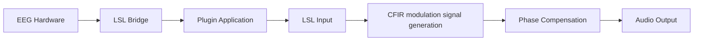

# Audio Neuromod

### Overview

---

A **JUCE plugin** that analyses **alpha-band EEG activity** and generates **phase-synchronised auditory stimulation** for neuromodulation research.

This project uses **[Lab Streaming Layer (LSL)](https://github.com/sccn/labstreaminglayer)** as a data inlet to remain **hardware-agnostic** and support a variety of EEG capture systems.

> **Digital Signal Processing** in this project is based on:  
> **Nikolai Smetanin, Anastasia Belinskaya, Mikhail Lebedev, and Alexei Ossadtchi (2020).**  
> *Digital filters for low-latency quantification of brain rhythms in real time.*  
> *Journal of Neural Engineering*, **17**(4), 046022.  
> [https://doi.org/10.1088/1741-2552/ab890f](https://doi.org/10.1088/1741-2552/ab890f) • [GitHub Repository](https://github.com/nikolaims/cfir)
>
> This plugin uses the **CFIR** implementation from the paper; a **weighted CFIR** version is planned for future development. See DSP below for more details

For setups using the **g.USBamp**, it is recommended to use the  **[g.USBamp LSL Bridge](https://github.com/labstreaminglayer/App-g.Tec)**.

Detailed hardware configuration and driver setup instructions are available in a **private repository**.  
Contact: [sol@glowinthedark.co.uk](mailto:sol@glowinthedark.co.uk)

---

### Building, Installation & Development

This plugin is built with the **[JUCE Framework](https://github.com/juce-framework/JUCE)** and automatically fetches **liblsl v1.16.2** during setup.

**Recommended IDE:** [CLion](https://www.jetbrains.com/clion/)  

The plugin can be built as a standalone audio application (reccomended) or VST3/AU for running from within a DAW.

### Using the plugin

---

#### Connecting to LSL

1. **Start EEG Streaming**  
   Begin EEG capture and streaming using your hardware (e.g. g.USBamp) over LSL.

2. **Connect to LSL Stream**  
   Click the **Connect** button to select and link to an active LSL EEG stream.  
   Use the **Channel Select** dropdown to choose between available EEG channels within that stream.

3. **Stream Button**  
   Press **Stream** to start capturing EEG data and generating playback.

4. **Mode**
    - **Closed Loop:** Normal operation using live EEG input via LSL.
    - **Open Loop:** The plugin acts as a synthesiser, producing internally generated modulation signals.  
      The modulation frequency is controlled by the **Mod Freq** parameter.

#### Scope Outputs
The plugin displays **three real-time scopes**:

1. **Top Scope:** Raw EEG signal from the selected channel.
2. **Middle Scope:** Instantaneous phase output from the **CFIR filter** (see *DSP* section).
3. **Bottom Scope:** Modulation signal used to drive the carrier oscillator, according to the settings in the modulation controls section.

#### Modulation

The plugin provides several **modulation modes and controls** that determine how the modulation signal derived from the incoming EEG stream affects the carrier oscillator.

- **Mod Mode** – Select the modulation type:
    1. **AM (Amplitude Modulation):** Simple convolution of the modulation signal with the carrier.
    2. **FM (Frequency Modulation):** Produces a low-pass filter sweep effect.
    3. **ISO (Isochronic):** Generates pulses delivered at each alpha phase-crossing point.

- **Waveform Type** – Choose the carrier waveform: *Sine*, *Square*, *Saw*, or *Triangle.*

- **Carrier Freq** – Sets the frequency of the carrier oscillator.

- **Envelope Mix** – Controls how strongly the alpha-band envelope (energy) influences modulation depth.
    - At **1**, modulation depth is fully driven by alpha signal strength, producing burst-like modulation linked to alpha power.
    - At **0**, a continuous modulation is generated based solely on the alpha phase.

- **Min Mod Depth / Max Mod Depth** – Define the lower and upper bounds of modulation depth. A larger difference between these values increases overall modulation intensity.

- **Mod Freq** *(open-loop mode only)* – Sets the frequency of the generated modulation signal.

### Latency, Compensation & Phase

The plugin is designed to provide **deterministic, configurable latency** in both the complex signal-processing chain and the handling of incoming **Lab Streaming Layer (LSL)** data.

It can also **compensate for known or measured delays** by applying a **phase rotation**, ensuring that auditory modulation remains aligned with the corresponding EEG activity in real time.

#### Setting Processing Latency

Two parameters (currently defined in `macros.h`, *to be exposed as JUCE parameters*) control the plugin’s overall latency:

#### `LSL_JITTER_BUF_DELAY_MS`
Defines the fixed delay (in milliseconds) before processing incoming LSL samples.  
This value should correspond to the EEG amplifier’s **frame size** and **sampling rate**:
- Larger frame sizes and lower sampling rates require a longer jitter buffer to maintain stable, continuous processing.
- **40 ms** is a conservative default suitable for most configurations.
- For high sampling rates and single-sample frame sizes, this value can be reduced significantly.

#### `CFIR_DELAY_SAMPLES`
Sets the number of samples by which the **CFIR filter output** is delayed.
- Lower values → reduced latency but less accurate phase approximation.
- Higher values → improved phase accuracy at the cost of increased delay.

#### Compensating for Measured Latency

The **Phase Control Slider** allows a **phase rotation** to be applied to the modulation signal in real time.  
This can be adjusted to compensate for both **system latency** (e.g. processing and hardware delays) and **perceptual latency** (user-specific auditory delay).

### Phase Compensation Calculator

A simple calculator is provided to assist with setting the correct phase offset:

1. **System Delay (ms):**  
   Enter the measured combined latency of the system and perceptual delay.

2. **Desired Phase (°):**  
   Specify the target phase alignment after compensation.

3. **Peak Alpha Frequency (Hz):**  
   Enter the subject’s dominant alpha frequency.  
   For basic applications, this can be approximated as **10 Hz**, though implementing a **training procedure** (*see To-Do*) would allow accurate per-patient measurement.

Click **“Calculate and Set”** to automatically adjust the **phase offset** according to these parameters.

### MIDI Output

The plugin also outputs the modulation signal as **MIDI Control Change (CC)** data, allowing it to be routed into a DAW for advanced modulation.

The output channel and CC number are set in `macros.h` using `MIDI_OUTPUT_CHANNEL` and `MIDI_OUTPUT_CC` (default: **Channel 1**, **CC 74**).

**Recommended setup (Ableton Live):**  
Create a virtual MIDI port, run the plugin in standalone mode, and select that virtual port as an input inside Ableton Live.

### Reccomended experimental Set-up
Use Lab recorder to record the Live Midi

### ToDo

---
- [ ] Implement **weighted CFIR** filtering with a ~1-minute per-subject training phase to estimate **PAF** and alpha band, and generate subject-specific filter weights (WCFIR).
- [ ] Expose **processing latency** controls as JUCE parameters in the UI.
- [ ] Add an **LSL outlet** for the modulation signal (for recording with LabRecorder or similar).
- [ ] Integrate **.XDF / .EDF** recording to capture incoming EEG and modulation signals directly within the plugin.

