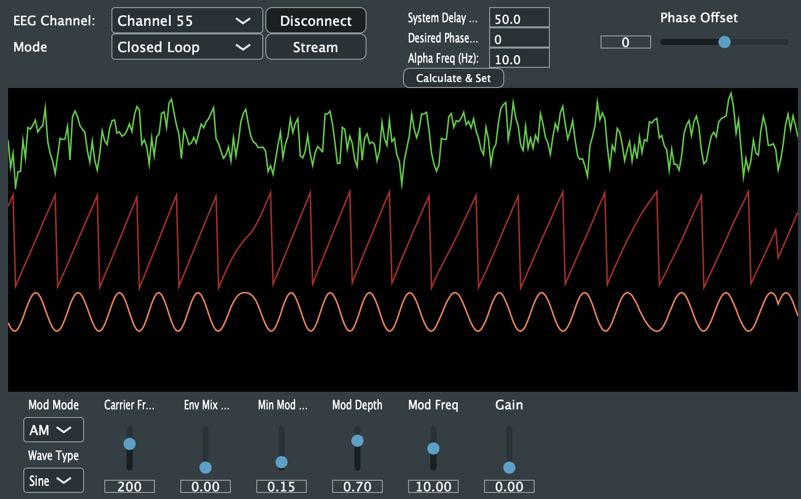
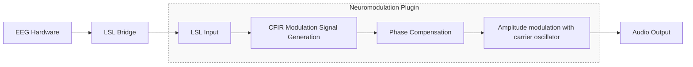
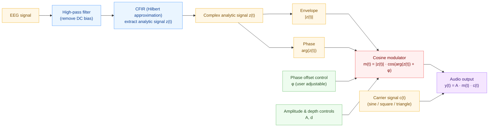

# Audio Neuromodulation

## Table of Contents
- [Overview](#overview)
- [Theory and DSP](#theory-and-dsp)
- [Building, Installation & Development](#building-installation--development)
    - [Requirements](#requirements)
    - [Pre-built Downloads](#pre-built-downloads)
    - [Building from Source](#building-from-source)
- [Using the Plugin](#using-the-plugin)
    - [Connecting to LSL](#connecting-to-lsl)
    - [Scope Outputs](#scope-outputs)
    - [Modulation](#modulation)
- [Latency, Compensation & Phase](#latency-compensation--phase)
    - [Setting Processing Latency](#setting-processing-latency)
    - [Compensating for Measured Latency](#compensating-for-measured-latency)
    - [Phase Compensation Calculator](#phase-compensation-calculator)
- [MIDI Output](#midi-output)
- [Recommended Additional Tools](#recommended-additional-tools)
- [Repository Structure](#repository-structure)
- [To-Do](#todo)
- [Disclaimer](#disclaimer)

### Overview

---


A **JUCE plugin** that analyses **alpha-band EEG activity** and generates **phase-synchronised auditory stimulation** for neuromodulation research.


*Example interface showing live EEG phase and modulation scopes.*



This project uses **[Lab Streaming Layer (LSL)](https://github.com/sccn/labstreaminglayer)** as a data inlet to remain **hardware-agnostic** and support a variety of EEG capture systems.

> **Digital Signal Processing** in this project is based on:  
> **Nikolai Smetanin, Anastasia Belinskaya, Mikhail Lebedev, and Alexei Ossadtchi (2020).**  
> *Digital filters for low-latency quantification of brain rhythms in real time.*  
> *Journal of Neural Engineering*, **17**(4), 046022.  
> [https://doi.org/10.1088/1741-2552/ab890f](https://doi.org/10.1088/1741-2552/ab890f) • [GitHub Repository](https://github.com/nikolaims/cfir)
>
> This plugin uses the **CFIR** implementation from the paper; a **weighted CFIR** version is planned for future development. See DSP below for more details


For setups using the **g.USBamp**, it is recommended to use the  **[g.USBamp LSL Bridge](https://github.com/labstreaminglayer/App-g.Tec)**.

Detailed hardware configuration and driver setup instructions are available in a **private repository**.  
Contact: [sol@glowinthedark.co.uk](mailto:sol@glowinthedark.co.uk)

### Theory and DSP



The core signal processing utilises a *least-squares complex-valued FIR (CFIR)* filter based on the method described by **Nikolai Smetanin et al.**

This CFIR filter approximates a Hilbert transform to provide near-instantaneous **phase** and **envelope** information from an incoming EEG signal centred around the alpha band *(default 8–12 Hz; adjustable via `macros.h` - see TODO for planned improvements).*

The extracted phase and envelope are then passed through a cosine function to construct a **parameterisable modulation signal**, with real-time adjustable **phase offset**, **amplitude**, and **modulation depth** parameters.

This modulation signal is subsequently used to modulate an audio output in a variety of different ways (see [modulation](#modulation) for details).

A High-pass filter can be optionally enabled and configured in `macros.h` to remove DC bias from incoming EEG, if not done earlier in the processing chain.


### Building, Installation & Development

---

### Requirements

- JUCE 7.0+
- liblsl v1.16.2 (automatically fetched)
- CMake 3.20+
- [CLion](https://www.jetbrains.com/clion/)  (recommended) or Visual Studio Code for development
- Tested on macOS 13+ and Windows 10+

The plugin can be built as a standalone audio application (recommended) or VST3 for running from within a DAW.

### Pre-built Downloads

Prebuilt binaries for **Windows** and **macOS** are available on the [Releases page](https://github.com/Sol455/audio_neuro_mod/releases). These are unsigned, so will have the click through the usual security pop-ups.

If you prefer to build from source, see below.

### Building from Source

**Windows**
- In CLion, go to **File → Settings → Build, Execution, Deployment → CMake → Toolchains**.
- Ensure the **Visual Studio (MSVC)** toolchain is selected — **not** MinGW.
- This ensures compatibility with JUCE, liblsl, and the Windows VST3 SDK.

**macOS**
- Use the default **Apple Clang / Xcode** toolchain.
- You can confirm this in **Preferences → Build, Execution, Deployment → Toolchains** if needed.


### Using the plugin

---

#### Connecting to LSL

1. **Start EEG Streaming**  
   Begin EEG capture and streaming using your hardware (e.g. g.USBamp) over LSL.

2. **Connect to LSL Stream**  
   Click the **Connect** button to select and link to an active LSL EEG stream.  
   Use the **Channel Select** dropdown to choose between available EEG channels within that stream.

3. **Stream Button**  
   Press **Stream** to start capturing EEG data and generating playback.

4. **Mode**
    - **Closed Loop:** Normal operation using live EEG input via LSL.
    - **Open Loop:** The plugin acts as a synthesiser, producing internally generated modulation signals.  
      The modulation frequency is controlled by the **Mod Freq** parameter.

#### Scope Outputs
The plugin displays **three real-time scopes**:

1. **Top Scope:** Raw EEG signal from the selected channel.
2. **Middle Scope:** Instantaneous phase output from the **CFIR filter** (see *DSP* section).
3. **Bottom Scope:** Modulation signal used to drive the carrier oscillator, according to the settings in the modulation controls section.


#### Modulation

The plugin provides several **modulation modes and controls** that determine how the modulation signal derived from the incoming EEG stream affects the carrier oscillator.

- **Mod Mode** – Select the modulation type:
    1. **AM (Amplitude Modulation):** Simple multiplication of the modulation signal with the carrier.
    2. **FM (Frequency Modulation):** Produces a low-pass filter sweep effect.
    3. **ISO (Isochronic):** Generates pulses delivered at each alpha phase-crossing point.

- **Waveform Type** – Choose the carrier waveform: *Sine*, *Square*, *Saw*, or *Triangle.*

- **Carrier Freq** – Sets the frequency of the carrier oscillator.

- **Envelope Mix** – Controls how strongly the alpha-band envelope (energy) influences modulation depth.
    - At **1**, modulation depth is fully driven by alpha signal strength, producing burst-like modulation linked to alpha power.
    - At **0**, a continuous modulation is generated based solely on the alpha phase.

- **Min Mod Depth / Max Mod Depth** – Define the lower and upper bounds of modulation depth. A larger difference between these values increases overall modulation intensity.

- **Mod Freq** *(open-loop mode only)* – Sets the frequency of the generated modulation signal.

### Latency, Compensation & Phase

The plugin is designed to provide **deterministic, configurable latency** in both the complex signal-processing chain and the handling of incoming **Lab Streaming Layer (LSL)** data.

It can also **compensate for known or measured delays** by applying a **phase rotation**, ensuring that auditory modulation remains aligned with the corresponding EEG activity in real time.

#### Setting Processing Latency

Two parameters (currently defined in `macros.h`, *to be exposed as JUCE parameters*) control the plugin’s overall latency:

#### `LSL_JITTER_BUF_DELAY_MS`
Defines the fixed delay (in milliseconds) before processing incoming LSL samples.  
This value should correspond to the EEG amplifier’s **frame size** and **sampling rate**:
- Larger frame sizes and lower sampling rates require a longer jitter buffer to maintain stable, continuous processing.
- **40 ms** is a conservative default suitable for most configurations.
- For high sampling rates and single-sample frame sizes, this value can be reduced significantly.

#### `CFIR_DELAY_SAMPLES`
Sets the number of samples by which the **CFIR filter output** is delayed.
- Lower values → reduced latency but less accurate phase approximation.
- Higher values → improved phase accuracy at the cost of increased delay.

#### Compensating for Measured Latency

The **Phase Control Slider** allows a **phase rotation** to be applied to the modulation signal in real time.  
This can be adjusted to compensate for both **system latency** (e.g. processing and hardware delays) and **perceptual latency** (user-specific auditory delay).

### Phase Compensation Calculator

A simple calculator is provided to assist with setting the correct phase offset:

1. **System Delay (ms):**  
   Enter the measured combined latency of the system and perceptual delay.

2. **Desired Phase (°):**  
   Specify the target phase alignment after compensation.

3. **Peak Alpha Frequency (Hz):**  
   Enter the subject’s dominant alpha frequency.  
   For basic applications, this can be approximated as **10 Hz**, though implementing a **training procedure** (*see To-Do*) would be desirable.

Click **“Calculate and Set”** to automatically adjust the **phase offset** according to these parameters.

### MIDI Output

The plugin also outputs the modulation signal as **MIDI Control Change (CC)** data, allowing it to be routed into a DAW for more complex modulation.

The output channel and CC number are set in `macros.h` using `MIDI_OUTPUT_CHANNEL` and `MIDI_OUTPUT_CC` (default: **Channel 1**, **CC 74**).

**Recommended setup (Ableton Live):**  
Create a virtual MIDI port, run the plugin in standalone mode, and select that virtual port as an input inside Ableton Live.


### Recommended additional tools

---

A number of supporting tools are recommended for use in experimental setups;

#### 1. LabRecorder
Records incoming EEG **Lab Streaming Layer (LSL)** streams to `.xdf` files for later analysis.  
Download: [https://github.com/labstreaminglayer/App-LabRecorder/releases](https://github.com/labstreaminglayer/App-LabRecorder/releases)

#### 2. SigViewer (Optional)
Lightweight viewer for inspecting and annotating recorded `.xdf` files.  
Download: [https://github.com/cbrnr/sigviewer](https://github.com/cbrnr/sigviewer)

#### 3. StreamViewer (Optional)
Real-time oscilloscope for monitoring active LSL streams during acquisition.  
Download: [https://github.com/intheon/stream_viewer](https://github.com/intheon/stream_viewer)

### Repository Structure

```
audio_neuro_mod/
├── CMakeLists.txt                # Main CMake configuration (builds JUCE + LSL + plugin)
├── README.md                     # Project documentation
│
├── Source/                       # Core plugin source code
│   ├── PluginProcessor.cpp/.h    # Main audio processor (JUCE - DSP entry point)
│   ├── PluginEditor.cpp/.h       # GUI implementation (JUCE)
│   ├── MidiOutputLayer.cpp/.h    # MIDI CC output layer
│   ├── OutputSyncLayer.cpp/.h    # Output synchronisation and timing, LI between EEG samples with a fixed loopback
│   ├── Params.h                  # Parameter definitions and IDs
│   ├── macros.h                  # Global configuration (band limits, phase offset, etc.)
│   │
│   ├── dsp/                      # DSP modules
│   │   ├── AudioEngine.cpp/.h    # Audio engine and processing loop
│   │   ├── Carrier.cpp/.h        # Carrier oscillator and waveform generation
│   │   ├── CFIRFilter.cpp/.h     # CFIR (complex FIR / Hilbert approximation)
│   │   ├── filterMod.cpp/.h      # Filter implementation and modulation signal generation
│   │   ├── dsp_worker.cpp/.h     # DSP worker thread 
│   │   ├── RunningPercentile.h   # Utility for calculating running percentile for adaptive thresholding of modulation (P2 algorithm)
│   │   └── simpleProfiler.h      # Lightweight profiling utilities
│   │
│   ├── lsl/                      # Lab Streaming Layer (EEG input) modules
│   │   ├── EegFIFO.h             # EEG sample FIFO buffer
│   │   ├── EegRingBuf.h          # Circular buffer for EEG data
│   │   ├── eegTypes.h            # EEG data type definitions
│   │   ├── lsl_connector.h       # LSL connection setup
│   │   ├── lsl_worker.h          # Stream reader and buffer management
│   │   ├── timestampMapper.cpp/.h# Timestamp synchronisation, maps lsl time stamps to the audio clock
│   │   └── (other headers)       # Supporting structures
│   │
│   └── ui/                       # User interface components
│       └── EegScopeComponent.h   # Custom EEG / modulation scope display
│
├── external/                     # Third-party dependencies
│   └── JUCE/                     # JUCE framework (fetched via submodule)
│
└── docs/                         # Documentation and assets
    └── plugin_ui.png             # Screenshot shown in README
```

*Overview of the main files and folders in the repository.*


### ToDo

---
- [ ] Implement **weighted CFIR** filtering with a ~1-minute per-subject training phase to estimate **PAF** and alpha band, and generate subject-specific filter weights for WCFIR (improved phase estimation).
- [ ] Expose **processing latency** controls as JUCE parameters in the UI.
- [ ] Add an **LSL outlet** for the modulation signal (for recording with LabRecorder or similar).
- [ ] Integrate **.XDF / .EDF** recording to capture incoming EEG and modulation signals directly within the plugin.

### Disclaimer
This plugin is an early-stage research prototype. It is intended primarily for experimentation in neuromodulation research. Expect occasional rough edges in code structure and user interface. Contributions welcome.